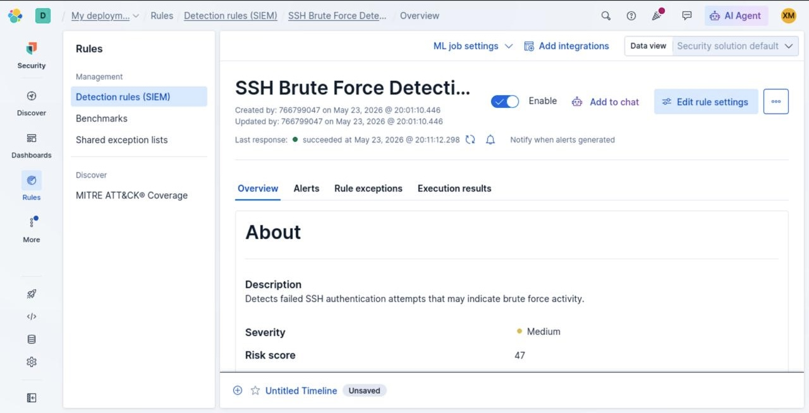
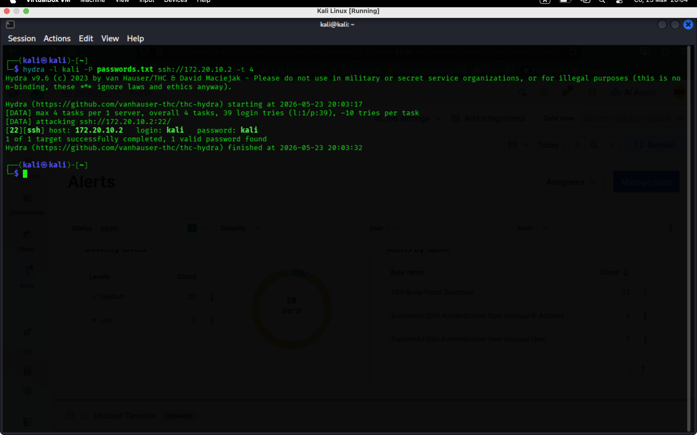

# Elastic Security SIEM – SSH Brute Force Detection

Blue Team / SOC Analyst practical detection engineering project focused on SSH brute force attack simulation, SIEM alert generation, event correlation, and Linux authentication log analysis using Elastic Security.

---

# Project Overview

This project demonstrates a complete SSH brute force attack detection workflow inside Elastic Security SIEM.

The objective was to:

* simulate malicious SSH authentication activity,
* collect Linux authentication telemetry,
* build custom KQL detection rules,
* generate SIEM alerts,
* investigate authentication events,
* correlate attack activity,
* validate brute force compromise behavior.

---

# Lab Environment

* Kali Linux
* Elastic Security (Elastic Cloud)
* Elastic Agent / Fleet
* OpenSSH
* Hydra
* Linux auth.log
* KQL Detection Rules
* VirtualBox Lab

---

# Attack Simulation

Hydra was used to simulate an SSH brute force attack against the target host.

```bash
hydra -l kali -P passwords.txt ssh://172.20.10.2 -t 4
```

The attack generated:

* multiple failed SSH login attempts,
* PAM authentication failures,
* successful authentication after repeated failures.

---

# Detection Engineering

Custom KQL Detection Rule:

```kql
event.dataset:"system.auth" and message:*Failed password*
```

Detection logic focused on:

* failed SSH authentication attempts,
* repeated login failures,
* authentication anomalies,
* brute force indicators.

---

# Investigation Findings

## Key Findings

* Multiple failed SSH authentication attempts detected
* Source IP identified: `172.20.10.2`
* Elastic Security generated medium severity alerts
* Authentication events correlated with `sshd-session`
* Linux auth.log contained PAM authentication failures
* Successful authentication observed after repeated failures
* Event correlation confirmed brute force behavior

---

# Indicators of Compromise (IoC)

* High-frequency failed SSH logins
* Repeated authentication failures
* Same source IP address
* PAM authentication failures
* Successful authentication after repeated failures
* SSH brute force alert generation

---

# MITRE ATT&CK Mapping

| Technique | Description       |
| --------- | ----------------- |
| T1110     | Brute Force       |
| T1110.001 | Password Guessing |
| T1078     | Valid Accounts    |

---

# Event Correlation

Observed attack pattern:

```text
Multiple failed login attempts
→ repeated authentication failures
→ SIEM alert generation
→ successful authentication
→ confirmed brute force compromise
```

---

# Security Impact

Potential risks:

* unauthorized access,
* credential compromise,
* privilege escalation,
* persistence opportunities,
* lateral movement.

---

# Mitigation Recommendations

* Enable Fail2Ban
* Apply account lockout policies
* Enforce strong password policies
* Enable MFA
* Restrict SSH access
* Monitor authentication logs continuously
* Deploy SIEM correlation rules

---

# Screenshots

## Elastic Detection Rule



## Elastic Security Alerts


## Elastic Discover Authentication Events


## Linux auth.log Investigation


## Hydra Attack Simulation



---

# Skills Demonstrated

* SIEM Deployment
* Detection Engineering
* KQL Querying
* Linux Log Analysis
* Event Correlation
* SSH Brute Force Detection
* Alert Investigation
* MITRE ATT&CK Mapping
* Blue Team Analysis
* SOC Workflow

---

# Conclusion

This project demonstrates practical SOC Level 1 and Blue Team detection engineering skills using Elastic Security SIEM.

The workflow successfully validated the ability to detect, investigate, and analyze malicious SSH authentication activity inside a realistic monitoring environment.
